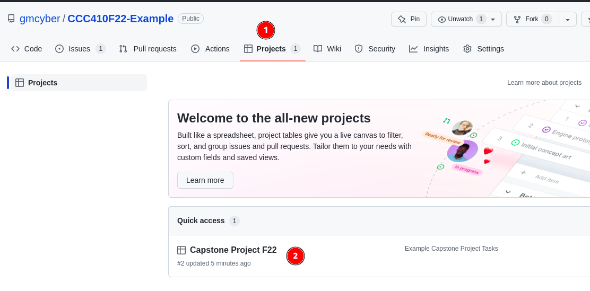

# Content Notes for Capstoners

Example of gmcyber's 2022 Capstone

This website represents a transition of CNCS captone content to a web based research, development and integration portfolio.  It leverages either github pages or wiki or markdown functionality to present a Capstone student's ongoing work to faculty, employers and peers.  Github pages is far more advanced and potentially more professional looking but requires some time to learn, particularly if you are going to use Jekyll.  Here's the initial advice on github pages or Wiki setup.  This repo can be used for templates and examples on markup.

## Straight up Markdown

Instead of using the wiki option, you can use a markdown editor and store your markdown and assets (images, files) in the same repository.  You will notice this wiki has a separate docs folder.  This move mitigates issues with the github wiki storing its content and images in entirely different locations as your source code.

## Github Wiki Option

This is pretty straight forward, you essentially just select the [Wiki Tab](https://github.com/gmcyber/CCC410F22-Example/wiki) and author your content in any supported markup language as many of you have done in your tech-jounals for CNCS courses.  The advantage of the github wiki is that it can remain private between you and chosen collaborators until you are ready to show it close to the end of the Design semester.  Github pages are wide open.

## Github Pages Option

This option holds far more potential and capabilites than the Wiki option.  With this option, comes a good deal of complexity.  Our suggestion would be to start with the Wiki option and then if constrained, consider Github pages.  Here are some basic tips.

* Create your capstone repo with a readme
* clone your repo locally
* create a docs/index.md directory and file and commit
* enable Github pages
  * Select master/docs as a source
  * Optionally select a custom domain if you own one (you will have some DNS work to do)
  * Select a Jekyll theme
* You should now be able to go to your repo
* Start hitting the youtubes and github pages documentation for how best to install and use ruby and [Jekyll](https://help.github.com/en/github/working-with-github-pages/setting-up-a-github-pages-site-with-jekyll) for your preferred operating system.  If you find yourself debugging github pages and Jekyll at the expense of actually working on your capstone, pick the simpler wiki strategy.

## Other options

* You are welcome to self publish using a variety of online publishing tools like gitbook.  Talk to your instructor on this.

## Project Management

* Github provides rudimentary Project management and tracking tools.  You can use other alternatives such as MS Project or Trello if you wish.  Talk to your instructor about expectations.

* One creates a project in your main github profile area and you link it to the specific repository within the project settings. 

    